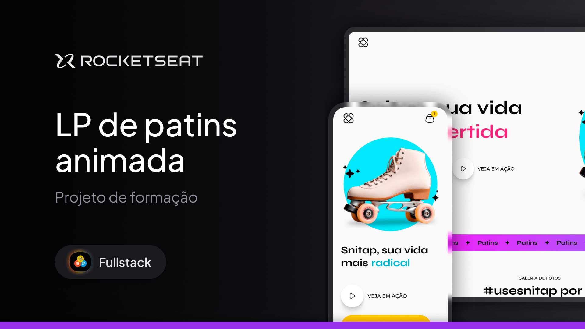

<h1 align="center"> Snaptap Landing Page</h1>

This project involves creating an animated landing page for the fictional Snaptap rollerblades. It is part of the Fullstack course by Rocketseat.

  <a href="#-technologies">Technologies</a>&nbsp;&nbsp;&nbsp;|&nbsp;&nbsp;&nbsp;
  <a href="#-project">Project</a>&nbsp;&nbsp;&nbsp;|&nbsp;&nbsp;&nbsp;
  <a href="#-layout">Layout</a>&nbsp;&nbsp;&nbsp;|&nbsp;&nbsp;&nbsp;
  <a href="#memo-license">License</a>

  

 

  

## 🚀 Technologies
This project was developed using the following technologies:

- HTML and CSS
- Git and GitHub
- Figma
- [TinyPNG](https://tinypng.com) – image compression
- [Responsively App](https://responsively.app) – responsive layout testing

## 💻 Project
Responsive and animated landing page for the fictional Snaptap rollerblades, developed as part of Rocketseat's Fullstack course.

Highlights:
- Desktop-first approach
- Clear separation between the static structure and the animation phase, improving comprehension and organization
- Final challenge: adaptation for smaller screen formats

- [Access the finished project](https://andreskull2.github.io/lp-patins-animado/)
- [Watch the course](https://www.rocketseat.com.br/formacao/fullstack)

## 🔖 Layout
You can view the layout through [this Figma file](https://www.figma.com/community/file/1379866810042169871).  
A [Figma](https://figma.com) account is required to access it.

## :memo: License
This project is licensed under the MIT license.

---
Made with ♥ by Rocketseat :wave: [Join our community!](https://discord.gg/rocketseat)
